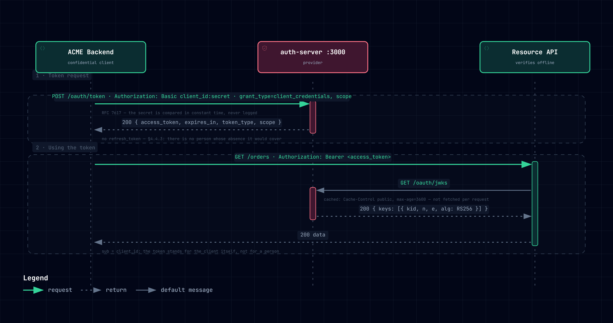
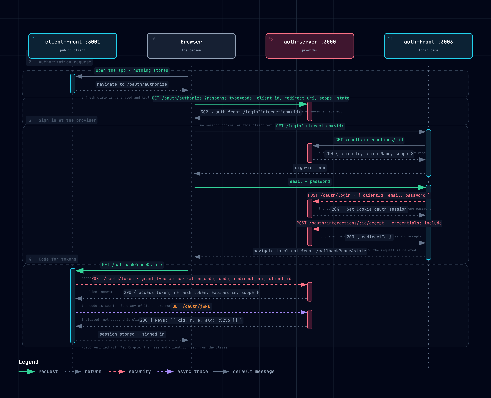
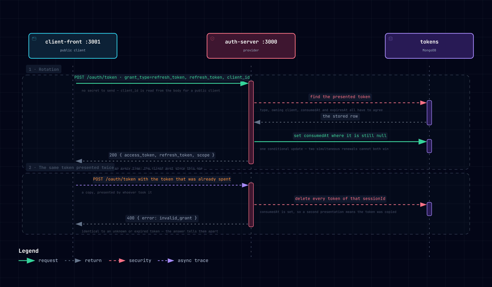

# OAuth 2.0 — a pure implementation

This repository is a **pure implementation of OAuth 2.0**, the authorization
standard defined in [RFC 6749](https://www.rfc-editor.org/info/rfc6749). An
RFC (*Request for Comments*) is the kind of technical publication used to
define internet standards.

## Why OAuth exists

OAuth was born from a simple need: **letting an application act on a
protected resource on a user's behalf, without ever handling that user's
password.**

In the traditional approach, anyone who wanted to reach a protected resource
had to authenticate against it directly with a **username and password**.
That design has several weak points:

| Problem | Why it hurts |
| --- | --- |
| **Every service must know the users** | Each resource has to hold (or reach) the whole user base just to decide who may access it. |
| **Third parties need the password** | If a third-party application needs access, the user has to hand over their own credentials to it. |
| **A leaked password opens everything** | A password is confidential and all-powerful: if it leaks at any point in the chain, it exposes everything the user can reach. |

The community recognized these issues, and OAuth 2.0 addresses them: the
user signs in **only** with the provider, and applications receive
**tokens** — limited in scope and time, and revocable — instead of
credentials.

## What this repository is (and isn't)

There are already **certified libraries** that comply with the standard
perfectly. I recommend [`oidc-provider`](https://www.npmjs.com/package/oidc-provider),
a very complete library that meets every requirement the standard sets.

This repository is **not a template or a reusable kit**. Its goal is to
show, in a visual and readable way:

- how the **flows** are composed;
- how the **system** is structured;
- which **roles** take part in each flow;
- **how** everything works and **why** it is written the way it is.

Once you understand that, feel free to implement the flow in your own
company — ideally with the help of a library such as `oidc-provider`.

> **To be clear:** this repo is purely **illustrative**. It represents the
> characteristics and flows the standard requires; it is not meant to run
> in production.

## Vocabulary

| Term | Meaning |
| --- | --- |
| **Authentication** | Proving **who** someone is (e.g. with an email and password). OAuth itself does not define it. |
| **Authorization** | Deciding **what** someone — or an application acting for them — **may do**. This is what OAuth standardizes. |
| **Scope** | A named permission the client asks for (e.g. `read`, `write`); the token only carries the scopes that were granted. |
| **Claims** | The individual pieces of information a token carries (`sub`, `exp`, `scope`, …). |
| **Grant type** | The way a client obtains a token (`authorization_code`, `refresh_token`, `client_credentials`). |
| **Token** | The credential the client receives instead of the password: an **access token** to call resources, and a **refresh token** to get a new one. |

## Stack

I chose **Next.js** and **NestJS** simply because they are the technologies
I know best and feel most confident working with.

In retrospect, they were **not the best choice for an example**. Both are
opinionated frameworks, designed to be used in a specific way and to solve
many problems for you — connections, communication, project structure.
That is great when you are building a complete application, but in an
example it adds layers that confuse more than they help. **The stack may
change in the future**; for now, this is it.

That extra complexity showed up first in the **backend**. NestJS already
defines a folder structure and a way to distribute code — all good so far.
The friction started with **data validation, entity management and
persistence**: the standard requires specific HTTP responses, specific
conditions for returning data, and specific error messages sent back to the
client at specific moments. To honor all of that, I had to **skip some of
the layers Nest offers** and implement those parts myself. That is why some
flows — especially **authorization** — are written in an **imperative
style**, with many explicit validations one after another.

Throughout the project I tried to **keep each layer's responsibilities
explicitly separated**: the business logic in one specific place, and the
persistence and presentation layers apart from it.

The **Next.js applications are pure frontends**: they run entirely in the
browser, with no server side of their own. This was a **deliberate
decision**: since I don't know which architecture or frontend technology
you use, I didn't want to tie the implementation to a specific model such as
SSR. If you have any frontend at all, you can replicate this flow just by
understanding its responsibilities.

## Projects and architecture

The repository is split into **three projects**, each playing a specific
part in the flow. The [roles](#oauth-roles) section maps them to the roles
the standard defines; this section only describes what each one is and how
its folders are organized.

| Project | What it is | Framework | Port |
| --- | --- | --- | --- |
| [`client-front`](client-front/) | The application a person signs in to | Next.js | `3001` |
| [`auth-front`](auth-front/) | The provider's sign-in page (its **login app**) | Next.js | `3003` |
| [`auth-server`](auth-server/) | The provider's **OAuth server** | NestJS | `3000` |

### `client-front` (Next.js)

This is the **client application**. Think of it as the place where the user
lands and starts interacting — a landing page or a SPA. To reach the
application's data the user has to **sign in** and **grant the application
access**, so it offers a **Sign in** button that starts the flow.

Think of this project as **one specific client** of the company: there
could be others — `dashboard-client`, `landing-client`, `crm-client` — all
belonging to the same company, each registered separately with the
provider.

It is a **public client**: it runs only in the browser, so it holds **no
client secret**.

```
src/
  app/          pages and routes (including /callback)
  components/   UI components
  services/     calls to the auth server
  constants/    fixed values
  types/        TypeScript types
  utils/        helpers (crypto, session)
  styles/       global styles
```

### `auth-front` (Next.js)

This is the provider's **login app**. I deliberately kept it as a **separate
project** from the client applications to separate responsibilities: its
only job is to **authenticate the user**. The person types their password
here and only here — `auth-front` sends it straight to `auth-server`, and the
client never sees it.

This example shows **internal authentication** (email and password), but
the login app is also the natural place to integrate **external identity
providers** such as Google, Facebook or Microsoft. Those integrations are
**out of the scope** of this example, but they could be implemented here.

It is also a **pure frontend** and **not an OAuth client**: it holds no
credentials of its own.

The folder structure follows the same pattern as `client-front`:

```
src/
  app/          pages and routes (including /login)
  components/   UI components
  services/     calls to the auth server
  constants/    fixed values
  types/        TypeScript types
  styles/       global styles
```

### `auth-server` (NestJS)

This is the **authorization server**. Its responsibility is to let a client
access resources **on the user's behalf**, so it contains every flow the
standard requires for that. Because it is also the provider's **internal**
server, it **manages the users** as well (it registers them) and
**authenticates** them.

> [!IMPORTANT]
> Managing and authenticating users is **not** a responsibility of an
> authorization server — I added it only to have a complete, working
> example. In a purer distribution these would be **two separate servers**:
> one to authenticate, one to authorize. OAuth 2.0 centers all of its logic
> on **authorization**; authentication methods are outside the scope of the
> standard.

The folder layout is guided by Nest's **modular architecture**, organized
into **three explicit layers**:

| Layer | Contains |
| --- | --- |
| **`common/`** | Shared, stateless pieces: decorators, guards, interfaces, utils. |
| **`core/`** | Nest-specific wiring that runs once: configuration, the database connection, middlewares. |
| **`modules/`** | The services themselves — every business area this server manages. |

Inside `modules/`:

| Module | Responsibility |
| --- | --- |
| **`client`** | Registers and manages clients. |
| **`user`** | Manages user accounts (each one scoped to a single client). |
| **`oauth`** | All of the authorization logic. |
| **`manager`** | For development only: clears every authorization request, code, session and token. |

### `auth-server` (grant flows)

The standard defines some specific grant flows, but it also allows new,
custom grant types to be created
([RFC 6749 §8.3](https://www.rfc-editor.org/rfc/rfc6749#section-8.3)). This
project is ready for that: adding a new grant flow only **extends** the
current functionality. All the grant flows are grouped in
[`oauth/flows/tokenExchange/grants`](auth-server/src/modules/oauth/flows/tokenExchange/grants/);
there you can see how each flow handles the authorization, and add whatever
grant you may need.

## OAuth roles

The standard defines **four roles** ([RFC 6749 §1.1](https://www.rfc-editor.org/rfc/rfc6749#section-1.1)).
This section describes each one and shows where it lives in this
repository.

| Role | In this repository |
| --- | --- |
| **Client** | `client-front` |
| **Resource Owner** | The person signing in, whose account lives in `auth-server`'s `user` module |
| **Resource Server** | No dedicated one yet; the protected part of `client-front` stands in for it |
| **Authorization Server** | `auth-server`'s `oauth` module |

> [!NOTE]
> Don't confuse a **role** with a **project**. `auth-server` plays more
> than one part: it is the authorization server, and it also manages and
> authenticates users. Keeping the two apart matters later, when replacing
> parts of this implementation with a third-party library.

### Client

As mentioned earlier, the client is **an application that belongs to the
company**: the application the user is authorized to operate through. In
this repository the client is `client-front`. Think of it as a landing page
or a profile application.

The standard defines **two client types** ([RFC 6749 §2.1](https://www.rfc-editor.org/rfc/rfc6749#section-2.1)),
and this repository supports both:

| Type | Can it keep a secret? | Trust level | Example |
| --- | --- | --- | --- |
| **Confidential** | **Yes**: it can store its client secret (the client's own password) securely. | **High**, which lets the server authorize it with more flexibility. | A backend application, a third-party service, a provider. |
| **Public** | **No**: its code and data can be inspected by anyone. | **Low** | `client-front` |

`client-front` is a **public client** because it is a pure frontend that
lives in the user's browser, so nothing inside it can be kept secret. It
*could* become a confidential client: with a server-side layer (SSR, for
example), the secret would live on the backend, a secure place. Within the
scope of this repository, it stays public.

The authorization server **manages the clients**. Each one is registered
with the following properties:

| Property | Description |
| --- | --- |
| **`id`** | The unique client identifier, the `client_id` ([§2.2](https://www.rfc-editor.org/rfc/rfc6749#section-2.2)). |
| **`clientSecret`** | The secret that authenticates this client ([§2.3.1](https://www.rfc-editor.org/rfc/rfc6749#section-2.3.1)). **Empty for public clients.** |
| **`isPublic`** | Whether the client is **public** or **confidential**. No secret is generated for a public client. |
| **`name`** | A readable name for the client. |
| **`allowedScopes`** | The scopes this client **may request**. Anything outside this list is refused. |
| **`redirectUris`** | The exact URIs the user may be sent back to after authorizing this client. Covered in depth in the flows section. |
| **`grantTypes`** | The grant types (flows) this client may use. They depend on the client type, because each flow has its own requirements. Defaults to `authorization_code` and `refresh_token`. |
| **`accessTokenTtlSeconds`** | *Not part of the standard.* The lifetime of the access tokens issued to this client (10, 30 or 60 minutes, for example; minimum 60 seconds). When absent, the server default applies. |

### Resource Owner

The standard describes the resource owner as *"an entity capable of
granting access to a protected resource"*. When that entity is a person, it
is the **end user**: the one who can **authenticate** with the identity
provider and who **grants** the client access to their resources.

The resource owner is not necessarily a person. In the **client
credentials** flow there is no user: the client acts **on its own behalf**
(another server or system, for example) and is, in effect, its own resource
owner.

This repository covers both cases (described in the flows section):

- **A person** signing in through the frontends.
- **A server** obtaining access for itself with `client_credentials`.

For people, I built the **identity provider** (the authentication part)
inside `auth-server`, in the `user` module. As mentioned earlier, **the
standard does not define how authentication works**, so this is my own
implementation. Feel free to implement and distribute it however you
prefer.

Each user has these properties:

| Property | Description |
| --- | --- |
| **`id`** | A unique identifier for the user. |
| **`email`** | Used instead of a username because it is personal and already unique to the user (unique within each client). |
| **`clientId`** | *My own addition.* The client this user belongs to. |
| **`passwordHash`** | The user's password, **hashed with bcrypt** so it is never stored in plain text. |

> [!IMPORTANT]
> **Every user belongs to exactly one client.** This is deliberate: a user
> registered for one application can access only that application. To use
> another one (the CRM, the landing page, the dashboard) the person has to
> register there as well, and the same email can exist once per client.
> Depending on your business needs, you can change this freely.

### Resource Server

The resource server **hosts the protected resources**: the confidential
part hidden from the public, which users ask to reach. It accepts and
validates the access tokens that the authorization server issues.

This repository **has no dedicated resource server yet**. Conceptually, its
role is played by the **protected half of `client-front`**, what the user
sees once authorized (the CRM itself, the dashboard, all that confidential
data). A real resource server would be an API that verifies each access
token offline against the public keys published at `GET /oauth/jwks`.

### Authorization Server

The authorization server lives in `auth-server`, in the `oauth` module.
Remember the note above: the **project** has two responsibilities, but only
this module plays the **role**.

It sits **between the client and the protected resource**. After the
resource owner authenticates, it **issues tokens** that let
the client access that resource **on the owner's behalf**.

To do this, the standard defines several **grant types**. This repository
implements **three**:

| Grant type | Used when |
| --- | --- |
| **`authorization_code`** | A person signs in and authorizes a client. |
| **`client_credentials`** | A client (usually a server) requests access for itself, with no user involved. |
| **`refresh_token`** | A client obtains a new access token without asking the person to sign in again. |

The **password** and **implicit** grants were **deliberately left out**.
Both are removed from the [OAuth 2.1 draft](https://datatracker.ietf.org/doc/draft-ietf-oauth-v2-1/)
and discouraged by the
[OAuth 2.0 Security Best Current Practice (RFC 9700)](https://www.rfc-editor.org/rfc/rfc9700#section-2.4).
Each flow is explained in detail below.

## Key characteristics

Before starting with the authorization flows, it is important to understand
a few things. They build on the terms introduced in the
[vocabulary](#vocabulary).

**Requests:** the requests a client sends directly to the **authorization
server** must be `POST` requests with a specific media type:
**`application/x-www-form-urlencoded`**
([RFC 6749 §3.2](https://www.rfc-editor.org/rfc/rfc6749#section-3.2)). In
other words, their parameters are encoded as URL search params, not as JSON.
We are going to detail each of them below. The only exception is the
authorization request, which the browser opens as a regular link, as you will
see in the authorization code flow.

**Authentication:** when the client is a **confidential client**, its
requests must be authenticated. This is done through **Basic
authentication** ([RFC 7617](https://www.rfc-editor.org/rfc/rfc7617)), with
this structure
([RFC 6749 §2.3.1](https://www.rfc-editor.org/rfc/rfc6749#section-2.3.1)):

```
Authorization: Basic base64(client_id:client_secret)
```

In `auth-server`, this behavior is handled by a guard called
**`BasicTokenGuard`**, which is in charge of enforcing the authentication on
the endpoints that require it.

**Tokens:** in this implementation, the access tokens are pieces of
information built as a **JWT** ([RFC 7519](https://www.rfc-editor.org/rfc/rfc7519)),
following the profile for access tokens
([RFC 9068](https://www.rfc-editor.org/rfc/rfc9068)). The JWT standard
defines the structure of each token which, in summary, can be split into
three parts:

- the **header**, which tells us the kind of cryptographic operations applied
  to the token ([RFC 7519 §5](https://www.rfc-editor.org/rfc/rfc7519#section-5));
- the **payload**, which contains the **claims** (characteristics related to
  the subject of the token, such as its owner) and also some information
  about the token's lifecycle, like its expiration
  ([RFC 7519 §4](https://www.rfc-editor.org/rfc/rfc7519#section-4));
- the **signature**.

Something important is that the token **must be signed**. This
implementation uses **RS256** (RSA with SHA-256), the algorithm every server
must support according to
[RFC 9068 §2.1](https://www.rfc-editor.org/rfc/rfc9068#section-2.1). To sign
a token you need a pair of keys, a **private** one and a **public** one; you
can find them in `auth-server/secrets`. The characteristic of these keys is
that, once a token is signed with the private key, its integrity can be
verified using only the **public key**, which the server publishes at
`GET /oauth/jwks` ([RFC 7517](https://www.rfc-editor.org/rfc/rfc7517)). That
allows external and public entities to make sure a token is valid: the
resource server **MUST** verify the signature
([RFC 9068 §4](https://www.rfc-editor.org/rfc/rfc9068#section-4)).

> The access token can contain information about its subject (the `sub`
> claim); that way we can identify who the token belongs to.

**Scope:** the scope tells what kind of operations the **client** is allowed
to perform on the resource server
([RFC 6749 §3.3](https://www.rfc-editor.org/rfc/rfc6749#section-3.3)). It
should never exceed the scopes registered for the client; that would mean it
is trying to perform operations it is not allowed to, and the server answers
with an `invalid_scope` error.

**Grants:** they are also important in the flow, because they tell us which
kinds of grants a client can apply for, and so they also shape the
operations the client can execute on the system. The grant types also define
the different ways to request access to the system (in this example:
**client credentials**, **authorization code** and **refresh token**).

## Flows

Now let's go through the flows.

### Client Credentials

*[RFC 6749 §4.4](https://www.rfc-editor.org/rfc/rfc6749#section-4.4)*

This is a **highly trusted** flow, and it should only be used by
**confidential clients**: it requires the client's secret to be kept safe on
the client's own server, so it is usually performed **between backend
services**.

In this project, the flow works like this:



*[Interactive version](docs/diagrams/client-credentials.html)*

As you can see in the diagram, this flow is made up of two steps:

1. The client (a backend service, in this case) sends a request to get the
   token. The request must be authenticated with Basic authentication,
   `base64(client_id:client_secret)`, and include these parameters
   ([§4.4.2](https://www.rfc-editor.org/rfc/rfc6749#section-4.4.2)):
   - **`grant_type`**: must be set to `client_credentials`.
   - **`scope`**: optional; it defines what kind of operations the client
     can perform on the resource server.

2. The authorization server is responsible for verifying the request
   parameters and returning an error if needed
   ([§5.2](https://www.rfc-editor.org/rfc/rfc6749#section-5.2)). Then it
   issues the token and returns it to the client
   ([§4.4.3](https://www.rfc-editor.org/rfc/rfc6749#section-4.4.3)).

To see this implementation, you can review the token endpoint
(`POST /oauth/token` in `auth-server`).

The result of this process is the issued **access token**. The token is the
key that allows us to access the confidential data, and it has an
**expiration time** that defines its lifetime. Once it has expired, the
client should request a new one to keep operating on the system.

> Something important in this flow is that the client credentials grant is
> **not meant to have a refresh token**, because it is not tied to a
> specific session
> ([§4.4.3](https://www.rfc-editor.org/rfc/rfc6749#section-4.4.3)).
>
> Another interesting characteristic is that the token itself is **not
> stored anywhere**: the only thing that tells us we can trust the token is
> its signature and its verification.

### Authorization Code

*[RFC 6749 §4.1](https://www.rfc-editor.org/rfc/rfc6749#section-4.1)*

This grant is used when a **person** is involved, and it is the right one
for **public clients**. As we described before, public clients are the ones
that cannot store a secret securely. In older implementations, the user
authenticated directly with the application using a username and password.

To avoid that, the standard defines this grant flow, where the client (the
application) never handles or has direct contact with the resource owner's
password.

To summarize a little: the idea of this flow is that the client doesn't need
to interact in any way with the resource owner's credentials. To prove the
client was granted access to the protected resource, the resource owner
authenticates with an **IdP** (identity provider), and then the server
creates a **code**. This code proves that the user authenticated
successfully and that the client can request a token. The code is returned
to the client, the client requests a token with it, and that's it: we can be
sure the user trusts this client to access the protected resource.

The flow looks like this:



*[Interactive version](docs/diagrams/authorization-code.html)*

As you can see in the sequence diagram, this flow involves many entities,
and at one point the browser redirects the view to an external interface
(the IdP); I'll explain why below. The flow starts like this:

1. First of all, the user starts the interaction through the client
   application (`client-front`). There we build the request parameters and
   start the process by calling the **authorization endpoint**
   (`GET /oauth/authorize`). An important part here is the set of parameters
   sent with the request
   ([§4.1.1](https://www.rfc-editor.org/rfc/rfc6749#section-4.1.1)):
   - **`response_type`**: must be set to `code`.
   - **`client_id`**: the identifier of the public client.
   - **`redirect_uri`**
     ([§3.1.2](https://www.rfc-editor.org/rfc/rfc6749#section-3.1.2)): this
     one is very important because, as I mentioned before, at some point the
     browser redirects the interface to an external frontend, so this value
     is the only thing that lets us return to the client once the user (the
     resource owner) is authenticated.
   - **`scope`**: the scope for the issued token.
   - **`state`**: a value that lets the client make sure the code returned
     by the authorization server is trusted
     ([§10.12](https://www.rfc-editor.org/rfc/rfc6749#section-10.12)).

2. The auth server receives the information and verifies that all the
   parameters meet the requirements; if they don't, it answers with an error
   ([§4.1.2.1](https://www.rfc-editor.org/rfc/rfc6749#section-4.1.2.1)).
   Then the authorization service creates an **authorization request** in
   the database. This request is a document that lets us interact with the
   IdP (`auth-front`); basically, it is where all the data about the
   authorization request is stored while the user is being authenticated.

3. Once the auth server has created the request, it redirects the user agent
   (the browser) to the IdP interface (`auth-front`) with the request id,
   the one piece that links the whole interaction. There, the resource owner
   interacts with the interface until they are authenticated.

   It is important to be clear about something here: at this point, the
   user can authenticate with any entity, either the provider's own identity
   service (the `user` module in `auth-server`, also called **first-party**
   identity) or an external one such as Google, Facebook or Microsoft
   (**third-party** IdPs). This project only implements the first one.

4. Once the user is authenticated and the provider has the user's data, it
   returns that information to the authorization server by **accepting the
   interaction**. The authorization server then creates the **authorization
   code**, removes the interaction (it is no longer needed), and returns the
   code to the **`redirect_uri`** where the login process started
   ([§4.1.2](https://www.rfc-editor.org/rfc/rfc6749#section-4.1.2)).

5. When the code response arrives at the client, the client needs to verify
   that all the data can be trusted; that is why `state` exists. The client
   takes the returned `state` and compares it with the local one it stored
   before starting the interaction: they must be the same. Then it requests
   the access token from the **token endpoint**
   ([§4.1.3](https://www.rfc-editor.org/rfc/rfc6749#section-4.1.3)), which
   expects these values:
   - **`grant_type`**: must be set to `authorization_code`.
   - **`code`**: the code received from the authorization flow.
   - **`redirect_uri`**: its own address, the same one sent in step 1.
   - **`client_id`**: the client identifier.

6. The authorization server verifies the request using the code and the
   client id (by the way, the code was stored in its own collection). Once
   everything checks out, it issues the tokens and returns them to the
   client. The response includes the **access token** and the **refresh
   token** ([§4.1.4](https://www.rfc-editor.org/rfc/rfc6749#section-4.1.4)).

7. The client verifies the token's signature (its authenticity) and stores
   the tokens; in this example, in the browser's `sessionStorage`.

To see this implementation, you can review the authorization endpoint
(`GET /oauth/authorize`) and the token endpoint (`POST /oauth/token`) in
`auth-server`.

That's it: the client has been granted access to the user's data.

> An important point here is how to manage the user session. That is
> related to the implementation, so it has its own section:
> [session management](#session-management). In general, session management
> is involved throughout this whole process, but I kept it "simple" here to
> describe the pure flow.
>
> This example also leaves out **PKCE**
> ([RFC 7636](https://www.rfc-editor.org/rfc/rfc7636)) to keep it to a single
> RFC, so `state` is the only protection the client has. A real public client
> should add it: [RFC 9700 §2.1.1](https://www.rfc-editor.org/rfc/rfc9700#section-2.1.1)
> requires it.

### Refresh Token

*[RFC 6749 §6](https://www.rfc-editor.org/rfc/rfc6749#section-6)*

The refresh token flow happens once an access token has been issued together
with a refresh token. The purpose of this token is to get a new access token
when the current one expires, **without asking the user to authenticate
again**.

The flow looks like this:



*[Interactive version](docs/diagrams/refresh-token.html)*

Here the flow is simpler:

1. The client sends a request to the authorization server's token endpoint
   with these parameters
   ([§6](https://www.rfc-editor.org/rfc/rfc6749#section-6)):
   - **`grant_type`**: must be set to `refresh_token`.
   - **`refresh_token`**: the local refresh token, the one persisted in the
     browser session when the access token was requested.
   - **`client_id`**: the client identifier.

2. Since we are talking about a public client (without a client secret), the
   authorization server needs to make sure the token is authentic. To do
   that, it checks it against the token store: it must exist in the database,
   belong to this client, not be expired and not have been used yet. Then the authorization server issues a
   new pair of tokens and returns them to the client
   ([§5.1](https://www.rfc-editor.org/rfc/rfc6749#section-5.1)), and the
   client stores them in the session again.

To see this implementation, you can review the token endpoint
(`POST /oauth/token` in `auth-server`).

The result of this process is a new access token **and** a new refresh
token: each refresh token can be used only once, which is known as
**rotation**.

> Unlike the access token, the refresh token **is stored**, because we need
> to know whether it has already been used. It doesn't contain any user
> information by itself (it is just a random value), so storing it doesn't
> expose user data, although it is still a credential and must be kept safe.
>
> If a refresh token that was already used is presented again, the server
> assumes it was copied and revokes the whole session
> ([RFC 9700 §4.14.2](https://www.rfc-editor.org/rfc/rfc9700#section-4.14.2)).


## Session management

Session management happens around the **authorization code** flow, the only
flow where a person signs in. For that, I declared a specific collection
(`sessions`) to know which user has an active session. This is important
because the client **cannot keep its session once the browser closes**: it
stores its tokens in `sessionStorage`, which is lost with the tab. So the
authorization server needs to know whether the user is still active.

The flow goes like this:

1. When the user authenticates (`POST /oauth/login`), the authorization
   server verifies their identity. If everything goes well, it creates a new
   **session** and stores its id in a **cookie** (`oauth_session`) on the
   authorization server's own domain; that will be important next. Then it
   returns an OK response to the login app (`auth-front`).

2. The login app then **accepts the interaction**
   (`POST /oauth/interactions/:id/accept`). The authorization server reads
   the session cookie, finishes the interaction, creates the **authorization
   code** and sends it back to the client, as we saw in the
   [authorization code](#authorization-code) flow.

3. While the browser is open, the client keeps its tokens in
   `sessionStorage`; but when the browser closes, they are lost. So when the
   user opens a new browser and visits the page again, the client silently
   calls the authorization endpoint in the background, with `prompt=none`
   (a parameter borrowed from
   [OpenID Connect](https://openid.net/specs/openid-connect-core-1_0.html#AuthRequest),
   meaning "don't show a login page"):
   - If the server recognizes the **cookie**, and the session is still open
     (it is registered in the database and belongs to this client), it
     issues a new code without asking for the password, and the client
     exchanges it for a new pair of tokens. The user is authorized again.
   - If the cookie doesn't exist, or the session has expired or ended, the
     server answers `login_required` and the client just shows the **Sign
     in** button to start a new authorization process.

When the user **signs out**, the client calls the revocation endpoint
(`POST /oauth/revoke`, [RFC 7009](https://www.rfc-editor.org/rfc/rfc7009)),
which revokes the tokens **and** ends the session, removing the cookie.
Otherwise, the next visit would sign them straight back in.

That is how the session works; you can follow it between the client and the
server by looking at the cookies they share.

> [!NOTE]
> A session lasts **30 days** and only works for the client it was opened
> for: accounts belong to one client, so this is **not SSO** (single
> sign-on).
>
> As I mentioned before, this session management is my own implementation.
> Each company should implement it in its own way, depending on its specific
> needs.

## Running it with Docker

You only need [Docker](https://docs.docker.com/get-docker/). From the
repository root:

```bash
cp auth-server/.env.example auth-server/.env
docker compose up -d --build
```

Then open **http://localhost:3001** and sign in.

| Service | Port | What it is |
| --- | --- | --- |
| `client-front` | [`3001`](http://localhost:3001) | The client application |
| `auth-front` | [`3003`](http://localhost:3003) | The login app |
| `auth-server` | [`3000`](http://localhost:3000/docs) | The authorization server (Swagger at `/docs`) |
| `mongo` | `27017` | The database |

On the first start, two short-lived containers run before `auth-server`:
`signing-keys` generates the key pair in `auth-server/secrets/` (only if it
doesn't exist yet), and `migrations` **fills MongoDB automatically** with a
seed migration. It creates:

| What | Values |
| --- | --- |
| **ACME Web** — public client, used by `client-front` | `client_id` `11111111-1111-4111-8111-111111111111` |
| **ACME Backend** — confidential client, `client_credentials` | `client_id` `22222222-2222-4222-8222-222222222222`, secret `33333333-3333-4333-8333-333333333333` |
| **A user** in each client | `alice@acme.test` / `password` |

To stop everything, run `docker compose down`; add `-v` to also wipe the
database.
